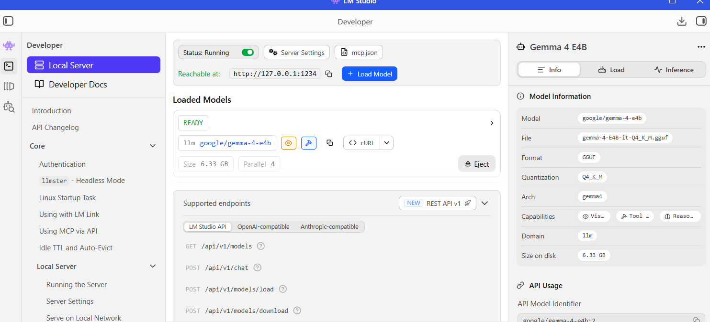
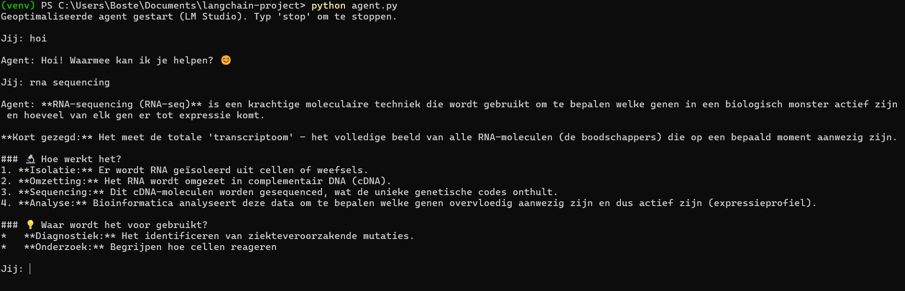
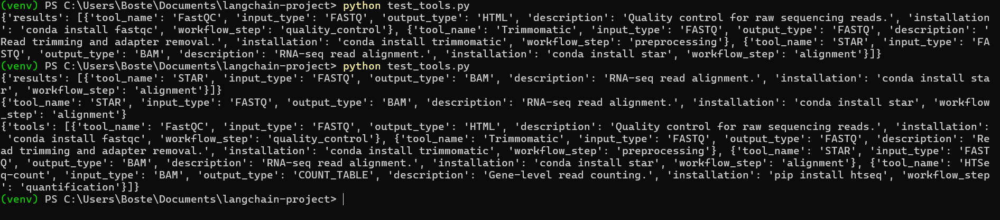

# Vrije opdracht

## Introductie

Voor mijn vrije opdracht kies ik ervoor om een nieuwe Data Science for Biology skill te leren die aansluit bij mijn toekomstige stage en mijn interesse in AI‑gestuurde bioinformatica workflows. Ik ga mij verdiepen in het bouwen van een doorzoekbare bioinformatica tool registry voor RNA‑seq workflows, gecombineerd met een deep dive in Model Context Protocol (MCP) en de AI‑frameworks LangChain en LangGraph.

Het doel is om te begrijpen hoe moderne AI‑agents tools kunnen aanroepen, workflows kunnen structureren en beslissingen kunnen nemen op basis van context. Door een registry te koppelen aan MCP en vervolgens te gebruiken binnen LangChain/LangGraph, kan ik een fundament leggen voor een intelligente RNA‑seq workflow die automatisch de juiste tools selecteert op basis van input, metadata en workflow‑stappen.

Deze skill sluit direct aan op mijn toekomstplan: tijdens mijn stage ga ik werken aan het automatiseren van RNA‑seq analyses. Door nu al te leren hoe tool‑registries, metadata‑structuren en AI‑workflow‑systemen werken, kan ik beter voorbereid starten en sneller waarde toevoegen.


## Doel van de opdracht

- Een tool registry opzetten met metadata over RNA‑seq tools (bijv. FastQC, STAR, Salmon, DESeq2).  
- Begrijpen hoe Model Context Protocol (MCP) werkt om tools toegankelijk te maken voor AI‑agents.  
- Leren hoe LangChain reasoning‑ketens bouwt die tools kunnen aanroepen.  


## Planning (32 uur)

### Fase 1: Oriëntatie en literatuur (6 uur; 4 mei 2026)
Doelen:
- begrijpen wat MCP is en hoe het tools beschikbaar maakt  
- basisconcepten van LangChain en LangGraph leren  
- voorbeelden van bioinformatica registries bestuderen (Bioconda, BioContainers, Bioconductor)

Activiteiten:
- documentatie lezen van MCP, LangChain en LangGraph  
- RNA‑seq tools inventariseren  
- bepalen welke metadata nodig is voor een registry  


### Fase 2: Opzetten van een basis registry (8 uur; 13 mei 2026)
Doelen:
- dataset maken met RNA‑seq tools en metadata  
- registry opslaan in CSV of JSON  
- nadenken over hoe MCP deze tools kan “exposen” aan een AI‑agent

Activiteiten:
- minimaal 15 tools verzamelen  
- metadata toevoegen (functie, inputtype, outputtype, installatie, workflow‑stap)  
- eerste versie van registry opslaan  


### Fase 3: Integratieconcept met MCP + LangChain (8 uur; 16 mei 2026)
Doelen:
- begrijpen hoe een AI‑agent tools kan aanroepen via MCP  
- prototype‑scripts schrijven die registry‑items kunnen worden opgevraagd  
- eenvoudige zoekfunctie bouwen in R of Python

Activiteiten:
- MCP‑voorbeeldprojecten bestuderen  
- simpele tool‑call structuur opzetten  
- zoekfunctie bouwen (bijv. “geef alle tools die FASTQ als input gebruiken”)  


### Fase 4: Rapportage en afronding (4 uur; 17 mei 2026)
Doelen:
- documenteren wat ik geleerd heb  
- reflecteren op de skill  
- voorbereiden op de uiteindelijke uitwerking

Activiteiten:
- RMarkdown‑verslag schrijven


## SMART-leerdoelen
### SMART-doel 1: RNA‑seq registry bouwen

**Specifiek:**  
Ik wil een RNA‑seq tool‑registry ontwikkelen die minimaal tien tools bevat, elk beschreven met metadata zoals tool_name, input_type, output_type, workflow_step en installatiemethode. De registry moet worden opgeslagen in JSON‑formaat zodat deze direct bruikbaar is in Python en MCP‑achtige tools.

**Meetbaar:**  
Het doel is behaald wanneer de registry minimaal tien volledig ingevulde tools bevat en wanneer ik deze succesvol kan inlezen en doorzoeken in Python.

**Acceptabel:**  
Dit doel sluit aan bij mijn huidige kennis van R en bioinformatica, en vormt een haalbare stap richting het bouwen van een AI‑gestuurde workflow.

**Realistisch:**  
Het bouwen van een JSON‑registry is technisch haalbaar binnen mijn vaardigheden en de beschikbare tijd, zeker omdat ik de tools en metadata zelf kan selecteren.

**Tijdsgebonden:**  
Ik wil deze registry binnen de eerste 12 uur van het project afronden, zodat ik deze in de rest van het project kan gebruiken voor MCP‑tools en agent‑simulatie.

<br.
<br>

### SMART‑doel 2: MCP‑achtige tools en agent‑simulatie

**Specifiek:**  
Ik wil minimaal drie MCP‑achtige tools in Python bouwen (zoals search_by_input, search_by_workflow_step en get_tool_info) die de registry kunnen doorzoeken en JSON‑achtige output teruggeven. Daarnaast wil ik een Python‑agent schrijven die ik via LM Studio kan aanroepen.

**Meetbaar:**  
Het doel is behaald wanneer alle drie de tools zonder fouten draaien in een testbestand (test_tools.py) en wanneer ik de agent.py succesvol kan starten en een vraag kan stellen.

**Acceptabel:**  
Dit doel past binnen mijn leerdoelen, omdat ik hiermee zowel Python‑vaardigheden als AI‑agentconcepten ontwikkel zonder dat ik een volledige MCP‑server hoef te implementeren.

**Realistisch:**  
Het bouwen van drie eenvoudige tools en een basisagent is haalbaar binnen mijn huidige niveau, zeker omdat ik de registry al beschikbaar heb als dataset.

**Tijdsgebonden:**  
Ik wil deze tools en de agent binnen 20 uur afronden, zodat ik in de resterende tijd mijn verslag kan schrijven en conceptueel kan uitleggen hoe LangChain en LangGraph hierbij zouden aansluiten.

## Uitwerking Fase 1

### Wat is MCP?
Het Model Context Protocol (MCP) vormt een gestandaardiseerd mechanisme waarmee AI‑agents beschikbare tools kunnen ontdekken, interpreteren en aanroepen binnen een workflow. MCP fungeert als een uniforme beschrijvingslaag waarin tools worden vastgelegd met hun naam, parameters, vereisten en verwachte output. Door deze standaardisatie kan een AI‑agent autonoom bepalen welke tool geschikt is voor een specifieke taak, zonder dat hiervoor handmatige koppelingen of complexe integraties nodig zijn. Dit maakt MCP bijzonder waardevol in omgevingen waar meerdere tools en systemen samenkomen, omdat het consistentie en interoperabiliteit bevordert (Anthropic, 2024).

### Wat is LangChain?
LangChain is een modulair framework dat AI‑systemen ondersteunt bij het uitvoeren van complexe taken door middel van stapsgewijze redenering en dynamische toolselectie. Het framework bestaat uit componenten zoals agents, tools en chains, die gezamenlijk een flexibele structuur vormen voor het bouwen van geavanceerde AI‑gedreven workflows. Een LangChain‑agent kan een gebruikersvraag analyseren, bepalen welke tool het meest geschikt is, deze tool aanroepen en de gegenereerde output integreren in een coherent antwoord. Hierdoor biedt LangChain een krachtige basis voor het verbinden van AI‑modellen met externe functies, API’s en databronnen (LangChain, 2023).


### RNA-sequencing tools inventariseren
Om te bepalen welke tools in de registry opgenomen moesten worden, is eerst een analyse uitgevoerd van de standaard RNA‑seq workflow. Deze workflow bestaat uit meerdere opeenvolgende stappen, waaronder kwaliteitscontrole, trimming, alignment, quantificatie, differentiële expressie en aanvullende utility‑stappen voor BAM/SAM‑verwerking. In plaats van slechts één representatieve tool per stap te selecteren, is in deze fase gekozen voor een bredere en realistischer set van vijftien veelgebruikte bioinformatica‑tools. Deze selectie vormt het conceptuele fundament voor de registry die in latere fasen door MCP‑achtige tools en AI‑agents gebruikt kan worden.
<br>
De opgenomen tools zijn:
<br>


- Kwaliteitscontrole: FastQC, MultiQC

- Trimming: Cutadapt, Trimmomatic

- Alignment: Bowtie2, STAR, HISAT2

- Quantificatie: FeatureCounts, Salmon, Kallisto

- Differentiële expressie: DESeq2, edgeR, Limma

- Utility (BAM/SAM‑verwerking): Samtools, Picard

<br>
Deze vijftien tools vormen gezamenlijk een volledige, flexibele en reproduceerbare RNA‑seq analyseketen. De tools nog niet technisch geïntegreerd, maar worden ze gebruikt om de structuur, metadata‑vereisten en doorzoekbaarheid van de registry te definiëren. Deze registry vormt vervolgens de basis voor de MCP‑achtige tools en de AI‑agent die in fase 3 zijn ontwikkeld.

### Metadata voor de registry
Op basis van bestaande bioinformatica‑ecosystemen (zoals Bioconda en BioContainers) is een set kernmetadata‑velden vastgesteld die noodzakelijk is om tools op een uniforme en doorzoekbare manier te beschrijven (Grüning et al., 2018). Voor fase 1 wordt gewerkt met één veld per categorie:
<br>

- tool_name (identiteit)

- function (beschrijving van de tool)

- input_type (vereiste inputbestanden)

- output_type (gegenereerde output)

- workflow_step (positie in de RNA‑seq workflow)
<br>
Deze beperkte set is voldoende om de registry‑structuur te ontwerpen. In latere fasen kan deze metadata worden uitgebreid en gekoppeld aan MCP en LangChain.


<br>
<br>
<br>
<br>

## Uitwerking Fase 2


``` r
#install.packages("jsonlite")
#install.packages("tibble")
#install.packages("tidyverse")
library(tibble)
library(jsonlite)
library(tidyverse)
```

```
## ── Attaching core tidyverse packages ──────────────────────── tidyverse 2.0.0 ──
## ✔ dplyr     1.2.1     ✔ purrr     1.2.2
## ✔ forcats   1.0.1     ✔ readr     2.2.0
## ✔ ggplot2   4.0.3     ✔ stringr   1.6.0
## ✔ lubridate 1.9.5     ✔ tidyr     1.3.2
## ── Conflicts ────────────────────────────────────────── tidyverse_conflicts() ──
## ✖ dplyr::filter()  masks stats::filter()
## ✖ purrr::flatten() masks jsonlite::flatten()
## ✖ dplyr::lag()     masks stats::lag()
## ℹ Use the conflicted package (<http://conflicted.r-lib.org/>) to force all conflicts to become errors
```

``` r
registry <- tibble(
  tool_name = c(
    "FastQC", "MultiQC",
    "Cutadapt", "Trimmomatic",
    "Bowtie2", "STAR", "HISAT2",
    "FeatureCounts", "Salmon", "Kallisto",
    "DESeq2", "edgeR", "Limma",
    "Samtools", "Picard"
  ),
  
  tool_function = c(
    "Quality control of FASTQ files",
    "Aggregates QC reports",
    "Adapter trimming",
    "Quality and adapter trimming",
    "Read alignment",
    "Splice-aware read alignment",
    "Splice-aware read alignment",
    "Gene-level quantification",
    "Transcript quantification",
    "Transcript quantification",
    "Differential gene expression",
    "Differential gene expression",
    "Differential gene expression",
    "BAM/SAM manipulation",
    "BAM/SAM processing and metrics"
  ),
  
  input_type = c(
    "FASTQ", "QC reports",
    "FASTQ", "FASTQ",
    "FASTQ", "FASTQ", "FASTQ",
    "BAM", "FASTQ", "FASTQ",
    "Count matrix", "Count matrix", "Count matrix",
    "BAM", "BAM"
  ),
  
  output_type = c(
    "HTML report", "HTML report",
    "Trimmed FASTQ", "Trimmed FASTQ",
    "BAM", "BAM", "BAM",
    "Count matrix", "Quantification files", "Quantification files",
    "DGE results", "DGE results", "DGE results",
    "Processed BAM", "Metrics report"
  ),
  
  install_method = c(
    "Conda", "Conda",
    "Conda", "Conda",
    "Conda", "Conda", "Conda",
    "Conda", "Conda", "Conda",
    "Bioconductor", "Bioconductor", "Bioconductor",
    "Conda", "Conda"
  ),
  
  workflow_step = c(
    "QC", "QC",
    "Trimming", "Trimming",
    "Alignment", "Alignment", "Alignment",
    "Quantification", "Quantification", "Quantification",
    "DGE", "DGE", "DGE",
    "Utility", "Utility"
  )
)

# Opslaan als CSV
write.csv(registry, "C:/Users/Boste/OneDrive/Documenten/rna_registry/data/registry.csv", row.names = FALSE)

# Opslaan als JSON
write_json(registry, "C:/Users/Boste/OneDrive/Documenten/rna_registry/data/registry.json", pretty = TRUE)
```

Deze registry vormt de basis voor het exposen van tools via het Model Context Protocol (MCP). MCP gebruikt JSON‑gebaseerde tool‑descripties om AI‑agents te laten ontdekken welke tools beschikbaar zijn, welke input en output ze verwachten en in welke workflow‑stap ze thuishoren.

Omdat de registry zowel in CSV als JSON is opgeslagen, kan een MCP‑server in fase 3 deze JSON‑structuur direct inlezen en elke tool beschikbaar maken als een “exposed tool”. Een AI‑agent kan vervolgens op basis van metadata zoals workflow_step, input_type en output_type bepalen welke tool geschikt is voor een bepaalde taak. Het maken van MCP tools volgt in fase 3.

## Uitwerking fase 3
Naast het opbouwen van mijn RNA‑seq tool‑registry heb ik mij ook verdiept in de technische basis die nodig is om deze registry later te kunnen koppelen aan AI‑agents en workflow‑systemen. Omdat Python de primaire taal is voor het bouwen van MCP‑tools en het simuleren van AI‑agentgedrag, heb ik ervoor gekozen om mij eerst de basis van Python eigen te maken. Hiervoor heb ik verschillende YouTube‑video’s bekeken over Python‑fundamentals, JSON‑verwerking en het schrijven van eenvoudige functies. Deze zelfstudie vormde een belangrijke stap, omdat ik hiermee de kennis opdeed die nodig is om mijn registry daadwerkelijk te kunnen gebruiken in een AI‑context.

Met deze basiskennis heb ik vervolgens een eigen Python‑script geschreven, agent.py, waarin ik een eenvoudige AI‑agent heb gebouwd. Deze agent kan ik lokaal aanroepen via LM Studio, dat fungeert als de LLM‑backend waarop mijn agent draait. Hierdoor kon ik experimenteren met het versturen van prompts, het ontvangen van antwoorden en het begrijpen van hoe een agent intern omgaat met context, geschiedenis en tool‑aanroepen. Het bouwen en testen van deze agent was een waardevolle oefening om inzicht te krijgen in hoe een AI‑systeem functioneert als tussenlaag tussen gebruiker en tools.

Parallel aan het leren van Python heb ik mijn RNA‑seq tool‑registry uitgebreid en opgeslagen in een JSON‑formaat dat ideaal is voor gebruik binnen Python. Deze registry bevat niet alleen de namen van tools, maar ook metadata zoals input‑ en outputtype, workflow‑stap, installatie‑instructies en een beschrijving van de functionaliteit. Deze rijkere structuur maakt het mogelijk om de registry te doorzoeken op basis van criteria zoals inputtype (bijvoorbeeld FASTQ), workflow‑stap (bijvoorbeeld alignment) of gewenste output. Dit sluit direct aan op hoe MCP‑tools informatie zouden aanleveren aan een AI‑agent.

Nu ik zowel een werkende registry als een functionerende agent heb, kan ik de volgende stap zetten: het bouwen van MCP‑achtige tools in Python. Dit zijn kleine functies die zich gedragen als MCP‑tools, zoals search_registry, filter_by_input of get_tool_info. Deze tools nemen gestructureerde input aan, doorzoeken de registry en geven een JSON‑achtige response terug. Hiermee kan ik demonstreren hoe een agent in theorie een tool zou aanroepen via MCP, zonder dat ik een volledige MCP‑server hoef te implementeren. In mijn verslag beschrijf ik vervolgens hoe deze MCP‑tools conceptueel geïntegreerd zouden kunnen worden binnen LangChain en LangGraph, door middel van pseudo‑code en architectuurdiagrammen.

Door deze stappen te combineren; het leren van Python, het bouwen van een agent, het aanroepen van deze agent via LM Studio, het opzetten van een rijke registry en het voorbereiden van MCP‑tools, leg ik een solide fundament voor een intelligente RNA‑seq workflow. De registry vormt de kennislaag, de MCP‑tools de operationele laag en de agent de interface die deze componenten in latere fasen kan verbinden met LangChain en LangGraph.

__Ai agent in Python aanroepen__ 
<br>
Om te demonstreren hoe mijn MCP‑achtige tools in Python functioneren, heb ik een eenvoudige AI‑agent gebouwd in het script agent.py. Deze agent maakt gebruik van mijn registry en kan vragen beantwoorden door de juiste Python‑functies aan te roepen. Deze code zet in neer in een R chunk omdat ik geen python code kan verwerken in dit Rmd bestand.

Deze agent.py is opgezet als een lichte, lokaal draaiende AI‑assistent die via LM Studio wordt aangestuurd. Bovenaan het script wordt een ChatOpenAI‑object geïnitialiseerd dat verbinding maakt met het lokale model op http://127.0.0.1:1234/v1. Hierdoor kan het model prompts verwerken zonder externe API‑sleutels of internetverbinding. De instellingen zijn bewust compact gehouden om snelle reacties te bevorderen.


<div style="text-align:center;">
  
</div>

Het script bevat daarnaast twee eenvoudige tools: read_file en write_file. Hiermee kunnen bestanden worden gelezen en geschreven wanneer een opdracht wordt gegeven in de vorm van use <toolnaam> <argument>. Deze tools worden opgeslagen in een dictionary, zodat de agent ze kan herkennen en uitvoeren.

Om de prestaties stabiel te houden, wordt een beperkte chatgeschiedenis bijgehouden. Via trim_history() blijft alleen de meest recente context behouden, waardoor de prompt klein blijft en de responstijd kort.

De kernfunctionaliteit bevindt zich in agent_response(). Deze functie controleert eerst of een tool moet worden aangeroepen. Als dat niet het geval is, wordt een compacte prompt opgebouwd op basis van de laatste berichten en doorgestuurd naar het taalmodel. Het gegenereerde antwoord wordt vervolgens toegevoegd aan de geschiedenis en teruggegeven aan de gebruiker.

Tot slot bevat het script een eenvoudige loop in main() die de agent start in de terminal. Via deze loop kunnen vragen worden ingevoerd en verwerkt totdat een stopcommando wordt gegeven.

Kort samengevat: deze code realiseert een snelle, minimalistische AI‑agent die lokaal draait via LM Studio, eenvoudige tools kan uitvoeren en een klein geheugen gebruikt om efficiënt te blijven reageren.


``` r
from langchain_openai import ChatOpenAI

llm = ChatOpenAI(
    base_url="http://127.0.0.1:1234/v1",
    api_key="lm-studio",
    model="google/gemma-4-e4b",
    temperature=0.2,
    max_tokens=512  # Token-limiet voor snelheid
)

#tools


def read_file(path: str) -> str:
    try:
        with open(path, "r") as f:
            return f.read()
    except Exception as e:
        return f"Fout bij lezen: {e}"

def write_file(args: str) -> str:
    try:
        path, content = args.split(":::", 1)
        with open(path, "w") as f:
            f.write(content)
        return f"Bestand opgeslagen: {path}"
    except Exception as e:
        return f"Fout bij schrijven: {e}"

tools = {
    "read_file": read_file,
    "write_file": write_file
}

# memory aanpassen zodat de ai agent sneller antwoord geeft en minder data opslaat
chat_history = []
MAX_HISTORY = 6  # maximaal 6 berichten (3 user + 3 assistant)

def trim_history():
    global chat_history
    if len(chat_history) > MAX_HISTORY:
        chat_history = chat_history[-MAX_HISTORY:]

#agent prompt

def agent_response(user_input: str):

    # Tool-aanroep
    if user_input.startswith("use "):
        try:
            _, tool_name, arg = user_input.split(" ", 2)
            if tool_name in tools:
                return tools[tool_name](arg)
            else:
                return f"Tool '{tool_name}' bestaat niet."
        except:
            return "Gebruik: use <toolnaam> <argument>"

# Trim geschiedenis
    trim_history()

# Snelle, lichte prompt
    messages = [
        {"role": "system", "content": "Je bent een snelle, efficiënte AI-assistent. Houd antwoorden kort en duidelijk."}
    ]

    # Alleen laatste 6 berichten meesturen
    for role, msg in chat_history:
        messages.append({"role": role, "content": msg})

    messages.append({"role": "user", "content": user_input})

    # LLM aanroepen
    response = llm.invoke(messages)

    # Opslaan in geschiedenis
    chat_history.append(("user", user_input))
    chat_history.append(("assistant", response.content))

    return response.content

# loop

def main():
    print("Geoptimaliseerde agent gestart (LM Studio). Typ 'stop' om te stoppen.\n")

    while True:
        user_input = input("Jij: ")

        if user_input.lower() in ["stop", "exit", "quit"]:
            print("Agent gestopt.")
            break

        output = agent_response(user_input)
        print("\nAgent:", output, "\n")

if __name__ == "__main__":
    main()
```

Door het script uit te voeren via de terminal met `python agent.py` wordt de agent gestart en kan ik interactief prompts invoeren. Hieronder is een screenshot te zien van de agent in actie, waarbij een vraag wordt gesteld en de gegenereerde output zichtbaar wordt.

<div style="text-align:center;">
  
</div>

__MCP tools maken__
<br>
De MCP‑achtige tools vormen een eenvoudige interface om de RNA‑seq registry te doorzoeken. Elke functie opent het JSON‑bestand registry.json en filtert de inhoud op basis van een specifiek criterium. De tool search_by_input() zoekt alle tools die een bepaald input‑type gebruiken, terwijl search_by_workflow_step() tools selecteert op basis van hun positie in de workflow. Met get_tool_info() kan informatie over één specifieke tool worden opgehaald, en list_all_tools()

``` r
import json

def search_by_input(input_type):
    with open("registry.json") as f:
        data = json.load(f)
    results = [tool for tool in data if tool["input_type"] == input_type]
    return {"results": results}

def search_by_workflow_step(step):
    with open("registry.json") as f:
        data = json.load(f)
    results = [tool for tool in data if tool["workflow_step"] == step]
    return {"results": results}

def get_tool_info(tool_name):
    with open("registry.json") as f:
        data = json.load(f)
    for tool in data:
        if tool["tool_name"].lower() == tool_name.lower():
            return tool
    return {"error": "Tool not found"}

def list_all_tools():
    with open("registry.json") as f:
        data = json.load(f)
    return {"tools": data}
```


Ik de functionaliteit van de MCP‑achtige tools daadwerkelijk getest in Python. Dit gebeurt door de Python‑functies direct aan te roepen, die dezelfde logica uitvoeren als een echte MCP‑tool.om de MCP tools te testen heb ik een apart bestand aangemaakt in Python genaamd test_tools.py. Hierin zet ik het volgende:

``` r
from mcp_tools import search_by_input, search_by_workflow_step, get_tool_info, list_all_tools

print(search_by_input("FASTQ"))
print(search_by_workflow_step("alignment"))
print(get_tool_info("STAR"))
print(list_all_tools())
```

De output van de test in Python is het volgende:
<div style="text-align:center;">
  
</div>

__functie van LangChain__
<br>
In een volledige implementatie zou LangChain worden gebruikt om mijn MCP‑achtige tools te integreren in een AI‑agent. LangChain biedt een standaardinterface voor tools, waardoor mijn Python‑functies (zoals search_by_input en get_tool_info) direct als “tools” beschikbaar zouden zijn voor de agent. De agent kan dan op basis van de gebruikersvraag automatisch beslissen welke tool moet worden aangeroepen. Hoewel ik LangChain in dit project niet implementeer, laat ik conceptueel zien hoe mijn registry en MCP‑tools in een LangChain‑agent zouden passen.


``` r
# tools = [
#    Tool(
#        name="search_by_input",
#        func=lambda x: search_by_input(x["input_type"]),
#        description="Zoekt tools op basis van inputtype."
#    )
#]
#
# agent = initialize_agent(tools=tools, llm=llm)
# agent.run("Welke tools gebruiken FASTQ?")
```


## Reflectieverslag 

### Terugblik op het proces en mijn leerervaring

In de afgelopen drie fasen heb ik een traject doorlopen waarin ik zowel conceptuele kennis als praktische vaardigheden heb ontwikkeld. Het project begon met het verkennen van theoretische fundamenten zoals het Model Context Protocol (MCP), LangChain en LangGraph. Deze concepten waren in het begin vrij abstract, maar gaven mij al snel richting bij het ontwerpen van mijn eigen RNA‑seq registry en het nadenken over hoe AI‑agents tools kunnen ontdekken en gebruiken. Vervolgens heb ik in R een uitgebreide registry opgebouwd met relevante RNA‑seq tools en metadata, die later de basis vormde voor mijn Python‑implementatie.

Daarna verschoof de focus naar Python: een taal waarin ik weinig ervaring had, maar die essentieel bleek voor het bouwen van MCP‑achtige tools en een werkende AI‑agent. Door tutorials te volgen en veel te experimenteren, heb ik geleerd hoe ik JSON‑data kan verwerken, functies kan schrijven en een agent kan aanroepen via LM Studio. Uiteindelijk heb ik MCP‑achtige tools gebouwd die mijn registry kunnen doorzoeken, en deze getest in een apart Python‑script. Dit gaf mij inzicht in hoe een agent en tools samenwerken binnen een AI‑workflow. Het project heeft mij niet alleen technische vaardigheden opgeleverd, maar ook een beter begrip van hoe moderne AI‑systemen worden opgebouwd en hoe je complexe concepten vertaalt naar werkende prototypes.

<br>

### Uitwerking van mijn SMART‑leerdoelen 

#### SMART‑doel 1: RNA‑seq registry bouwen

**Specifiek:**  
Ik wilde een RNA‑seq registry ontwikkelen met minimaal tien tools, elk voorzien van metadata zoals tool_name, input_type, output_type, workflow_step en installatiemethode.  
**Meetbaar:**  
Het doel was behaald wanneer de registry volledig gevuld was en succesvol kon worden ingelezen en doorzocht in Python.  
**Acceptabel:**  
Dit doel sloot aan bij mijn bestaande kennis van R en bioinformatica.  
**Realistisch:**  
Het bouwen van een JSON‑registry was haalbaar binnen mijn vaardigheden en tijd.  
**Tijdsgebonden:**  
Ik wilde dit binnen de eerste 12 uur afronden.

**STARR‑reflectie op doel 1**

**Situatie:**  
Aan het begin van het project had ik een duidelijk beeld nodig van welke tools in een RNA‑seq workflow thuishoren en hoe ik deze formeel kon beschrijven.

**Taak:**  
Mijn taak was om een gestructureerde registry te maken die later bruikbaar zou zijn voor MCP‑tools en een AI‑agent.

**Actie:**  
Ik heb RNA‑seq tools geïnventariseerd, metadata‑velden bepaald en in R een tibble opgebouwd die ik vervolgens exporteerde naar JSON. Hierbij heb ik bewust gekozen voor velden die aansluiten bij MCP‑toolbeschrijvingen.

**Resultaat:**  
De registry bevat meer dan tien tools, is volledig doorzoekbaar en wordt succesvol ingelezen in Python. Dit maakt het mogelijk om MCP‑achtige tools te bouwen die deze registry gebruiken.

**Reflectie:**  
Ik ben tevreden over dit resultaat. Het doel was concreet en goed uitvoerbaar. Ik heb geleerd hoe belangrijk consistente metadata is voor AI‑systemen en hoe een goed ontworpen dataset de basis vormt voor verdere automatisering.

<br>

#### SMART‑doel 2: MCP‑achtige tools en Python‑agent

**Specifiek:**  
Ik wilde minimaal drie MCP‑achtige tools bouwen (zoals search_by_input, search_by_workflow_step en get_tool_info) en een Python‑agent schrijven die ik via LM Studio kan aanroepen.  
**Meetbaar:**  
Het doel was behaald wanneer de tools foutloos draaiden in test_tools.py en de agent.py succesvol vragen kon verwerken.  
**Acceptabel:**  
Dit doel paste bij mijn leerdoelen rondom Python en AI‑agents.  
**Realistisch:**  
Het bouwen van drie tools en een basisagent was haalbaar binnen de beschikbare tijd.  
**Tijdsgebonden:**  
Ik wilde dit binnen 20 uur afronden.

**STARR‑reflectie op doel 2**

**Situatie:**  
Ik had nog geen tot weinig Python‑ervaring, maar moest wel MCP‑achtige tools bouwen en een agent laten draaien.

**Taak:**  
Mijn taak was om Python‑functies te schrijven die de registry konden doorzoeken en een agent te bouwen die deze functies zou kunnen gebruiken.

**Actie:**  
Ik heb Python‑tutorials gevolgd, mijn eigen agent.py geschreven en MCP‑achtige tools ontwikkeld. Vervolgens heb ik een testbestand gemaakt om de tools systematisch te testen.

**Resultaat:**  
Alle tools werken correct en geven JSON‑achtige output terug. De agent draait via LM Studio en kan vragen verwerken. Hiermee heb ik het volledige doel behaald.

**Reflectie:**  
Ik heb veel geleerd over Python, JSON‑verwerking en AI‑agentgedrag. Het was uitdagend, maar het gaf me een goed inzicht in hoe tools en agents samenwerken. Ik ben vooral trots dat ik dit zonder voorkennis van Python heb kunnen realiseren.Het heeft me echter meer dan 20 uur gekost, door het literatuuronderzoek, het aanleren van python basis taal en het uitzoeken hoe een MCP tool en registry data set gemaakt moesten worden. 

<br>

### Vervolgstappen en toekomst

Hoewel ik in deze fasen veel heb bereikt, zie ik nog duidelijke vervolgstappen. Een belangrijke volgende stap is het daadwerkelijk implementeren van een MCP‑server, zodat mijn MCP‑achtige tools via een echt protocol kunnen worden aangeroepen. Daarnaast wil ik mijn registry koppelen aan een echte LangChain‑agent, zodat toolselectie automatisch verloopt op basis van gebruikersvragen.

Het meest interessante vervolg ligt echter bij LangGraph. LangGraph biedt een manier om complexe workflows te modelleren als graphs met nodes, edges en state‑management. Voor een RNA‑seq workflow is dit ideaal: elke stap (QC, trimming, alignment, quantificatie, DGE) kan worden weergegeven als een node, terwijl de afhankelijkheden tussen stappen worden vastgelegd als edges. Het ingebouwde state‑management maakt het mogelijk om tussentijdse resultaten op te slaan en door te geven aan volgende stappen (LangChain, 2024). In dit project heb ik LangGraph alleen conceptueel behandeld, maar in een vervolg zou ik graag een volledige RNA‑seq workflow modelleren in LangGraph, inclusief branching, parallelle stappen en automatische toolselectie.

Door deze vervolgstappen te realiseren, kan mijn project uitgroeien tot een volledig AI‑gestuurde workflow‑engine die bioinformatica‑analyses reproduceerbaar, transparant en intelligent maakt.


