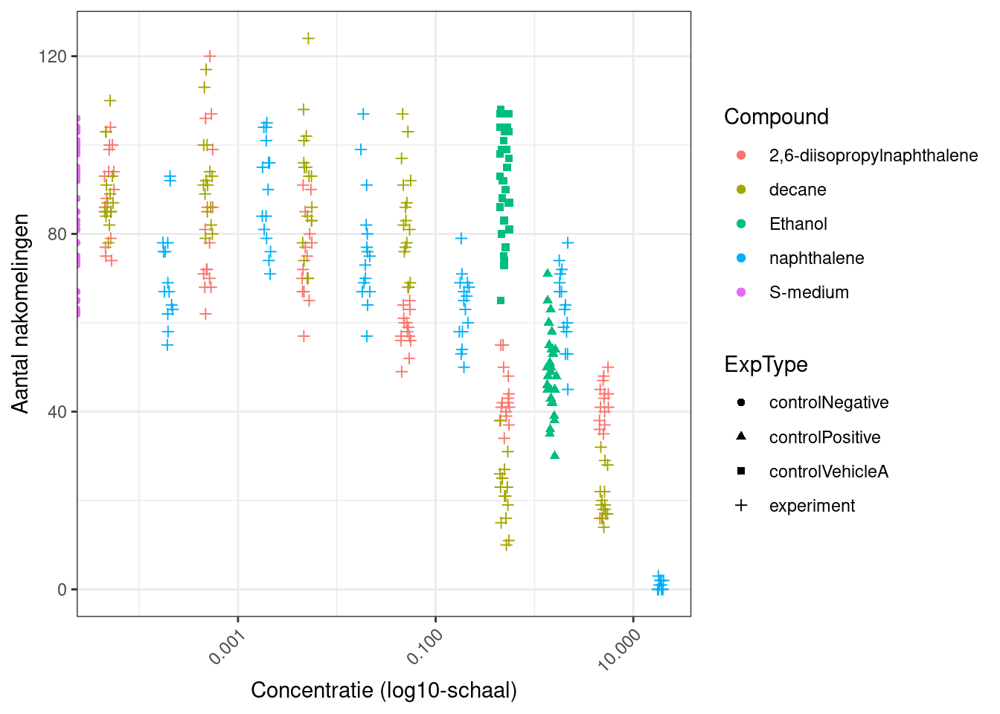

# opdracht 4a


In deze analyse wordt we data van C. elegans geanalyseerd die zijn blootgesteld aan verschillende concentraties van diverse chemicaliën.
Doel: de analyse reproduceerbaar uitwerken met RMarkdown, inclusief visualisatie, normalisatie en een stappenplan richting dose–response analyse.


``` r
# data inlezen
data <- read_excel("/home/bo.steinschuld/dsfb2_workflows_portfolio/data_raw/CE.LIQ.FLOW.062_Tidydata.xlsx")


data %>%
  select(RawData, compName, compConcentration, expType) %>%
  summary()
```

```
##     RawData        compName         compConcentration    expType         
##  Min.   :  0.0   Length:360         Length:360         Length:360        
##  1st Qu.: 51.5   Class :character   Class :character   Class :character  
##  Median : 72.0   Mode  :character   Mode  :character   Mode  :character  
##  Mean   : 68.1                                                           
##  3rd Qu.: 88.0                                                           
##  Max.   :124.0                                                           
##  NA's   :5
```

``` r
str(data %>% select(RawData, compName, compConcentration, expType))
```

```
## tibble [360 × 4] (S3: tbl_df/tbl/data.frame)
##  $ RawData          : num [1:360] 44 37 45 47 41 35 41 36 40 38 ...
##  $ compName         : chr [1:360] "2,6-diisopropylnaphthalene" "2,6-diisopropylnaphthalene" "2,6-diisopropylnaphthalene" "2,6-diisopropylnaphthalene" ...
##  $ compConcentration: chr [1:360] "4.99" "4.99" "4.99" "4.99" ...
##  $ expType          : chr [1:360] "experiment" "experiment" "experiment" "experiment" ...
```

``` r
# ik zie bij compName en compConcentration  characters staan terwijl dit factors en nummers moeten zijn.

# Daarom aanpassen:
data <- data %>%
  mutate(
    RawData           = as.numeric(RawData),
    compName          = as.factor(compName),
    expType           = as.factor(expType),
    compConcentration = as.numeric(compConcentration)
  )

str(data %>% select(RawData, compName, compConcentration, expType))
```

```
## tibble [360 × 4] (S3: tbl_df/tbl/data.frame)
##  $ RawData          : num [1:360] 44 37 45 47 41 35 41 36 40 38 ...
##  $ compName         : Factor w/ 5 levels "2,6-diisopropylnaphthalene",..: 1 1 1 1 1 1 1 1 1 1 ...
##  $ compConcentration: num [1:360] 4.99 4.99 4.99 4.99 4.99 4.99 4.99 4.99 4.99 4.99 ...
##  $ expType          : Factor w/ 4 levels "controlNegative",..: 4 4 4 4 4 4 4 4 4 4 ...
```


``` r
# Scatterplot met:
# - compConcentration op x-as
# - RawData op y-as
# - kleur = compName
# - shape = expType
# - log10 x-as
# - jitter om overlap te voorkomen
# - leesbare labels
ggplot(data,
       aes(x = compConcentration,
           y = RawData,
           colour = compName,
           shape = expType)) +
  geom_point(position = position_jitter(width = 0.05, height = 0)) +
  scale_x_log10(
    labels = scales::label_number(),
    breaks = scales::log_breaks()
  ) +
  theme_bw() +
  labs(
    x = "Concentratie (log10-schaal)",
    y = "Aantal nakomelingen",
    colour = "Compound",
    shape = "ExpType"
  ) +
  theme(
    axis.text.x = element_text(angle = 45, hjust = 1)
  )
```




``` r
# Controleer datatypes

data <- data %>%
  mutate(
    RawData = as.numeric(RawData),
    compConcentration = as.numeric(compConcentration),
    compName = as.factor(compName),
    expType = as.factor(expType)
  )


# Bereken gemiddelde negatieve controle

neg_mean <- data %>%
  filter(expType == "controlNegative") %>%
  summarise(mean_neg = mean(RawData, na.rm = TRUE)) %>%
  pull(mean_neg)

neg_mean   # handig om te printen
```

```
## [1] 85.9
```

``` r
# Normaliseer alle waarden

data_norm <- data %>%
  mutate(RawData_norm = RawData / neg_mean)


# Scatterplot met genormaliseerde waarden

ggplot(data_norm,
       aes(x = compConcentration,
           y = RawData_norm,
           colour = compName,
           shape = expType)) +
  geom_point(position = position_jitter(width = 0.05, height = 0)) +
  scale_x_log10(
    labels = scales::label_number(),
    breaks = scales::log_breaks()
  ) +
  theme_bw() +
  labs(
    x = "Concentratie (log10-schaal)",
    y = "Genormaliseerde nakomelingen (t.o.v. negatieve controle = 1)",
    colour = "Compound",
    shape = "ExpType"
  ) +
  theme(
    axis.text.x = element_text(angle = 45, hjust = 1)
  )
```


In dit experiment zijn C. elegans blootgesteld aan verschillende concentraties van diverse chemicaliën om te onderzoeken hoe deze stoffen de voortplanting beïnvloeden. Om de resultaten betrouwbaar te kunnen interpreteren, is het essentieel om te begrijpen welke controles in het experiment zijn opgenomen en waarom deze nodig zijn. De dataset bevat drie typen controles: een negatieve controle, een positieve controle en een vehicle controle.

De negatieve controle bestaat uit wormen die niet zijn blootgesteld aan een werkzame stof. Dit is de conditie waarin we het normale, gezonde aantal nakomelingen verwachten. Deze controle vormt het referentiepunt van het experiment: alle andere metingen worden hiertegen afgezet. De negatieve controle laat zien hoe de wormen zich gedragen zonder enige vorm van toxiciteit of verstoring, en is daarom cruciaal om te bepalen of een compound daadwerkelijk een effect heeft.

De positieve controle bevat een stof waarvan bekend is dat deze een sterk toxisch effect heeft op C. elegans. Het doel van deze controle is om te bevestigen dat de assay goed functioneert: als de positieve controle geen duidelijk effect laat zien, dan is er iets mis met het experiment (bijvoorbeeld met de wormen, de incubatiecondities of de meetmethode). De positieve controle fungeert dus als een kwaliteitscheck van het hele systeem.

Daarnaast is er de vehicle controle, waarin de wormen worden blootgesteld aan het oplosmiddel (bijvoorbeeld DMSO) zonder werkzame stof. Veel chemicaliën moeten worden opgelost in een solvent voordat ze aan de wormen kunnen worden toegediend. Het is daarom belangrijk om te controleren of dit oplosmiddel zelf geen effect heeft op de voortplanting. Als de vehicle controle hetzelfde gedrag laat zien als de negatieve controle, weten we dat eventuele effecten in de experimentele condities niet worden veroorzaakt door het oplosmiddel.

Om de resultaten tussen verschillende condities en concentraties goed te kunnen vergelijken, is de data vervolgens genormaliseerd ten opzichte van de negatieve controle. Hierbij wordt het gemiddelde aantal nakomelingen in de negatieve controle gelijkgesteld aan 1. Alle andere waarden worden uitgedrukt als een fractie van deze baseline. Deze normalisatie heeft meerdere voordelen: het corrigeert voor variatie tussen experimentdagen, maakt de resultaten intuïtiever te interpreteren en zorgt ervoor dat verschillen tussen compounds en concentraties duidelijker zichtbaar worden. Een waarde kleiner dan 1 duidt op een toxisch effect (minder nakomelingen dan normaal), terwijl een waarde groter dan 1 wijst op stimulatie of verhoogde voortplanting. Door deze aanpak ontstaat een helder en reproduceerbaar beeld van de effecten van de verschillende chemicaliën op de wormen.


__stappenplan voor vervolgonderzoek__

``` r
# let op: deze code voer ik niet uit, dit is alleen het stappenplan!
# Deze code voert alle stappen uit die nodig zijn om een 
# dose–response curve te fitten en de IC50 te bepalen.

# Laad benodigde packages 
# drc = dose-response modelling
# tidyverse = data manipulatie en plotting
install.packages("drc", dependencies = TRUE)
library(drc)
library(tidyverse)

# Selecteer één compound voor de analyse 
# Kies hier de naam van het compound dat je wilt analyseren.
compound_of_interest <- "2,6-diisopropylnaphthalene"

# Filter alleen:
# - dit compound
# - experimentele metingen (dus geen controles)
# - genormaliseerde respons (RawData_norm)
dose_data <- data_norm %>%
  filter(compName == compound_of_interest,
         expType == "experiment") %>%
  select(compConcentration, RawData_norm) %>%
  drop_na()

# Controleer of de data er goed uitziet
head(dose_data)


# Visualiseer ruwe dose–response relatie 
# Dit is een snelle check om te zien of er een dalende trend is.
ggplot(dose_data,
       aes(x = compConcentration, y = RawData_norm)) +
  geom_point(size = 3) +
  scale_x_log10() +
  theme_bw() +
  labs(
    title = paste("Ruwe dose–response voor", compound_of_interest),
    x = "Concentratie (log10-schaal)",
    y = "Genormaliseerde respons"
  )


# Fit een 4-parameter log-logistisch model (LL.4) 
# LL.4 heeft vier parameters:
# - Lower: minimale respons
# - Upper: maximale respons
# - Slope: steilheid van de curve
# - IC50: concentratie waarbij 50% effect optreedt
m_LL4 <- drm(
  RawData_norm ~ compConcentration,
  data = dose_data,
  fct = LL.4(names = c("Slope", "Lower", "Upper", "IC50"))
)

# Bekijk modelresultaten
summary(m_LL4)


# Plot de dose–response curve 
# Dit geeft een nette S-curve met de ruwe punten erbij.
plot(
  m_LL4,
  log = "x",
  xlab = "Concentratie (log10-schaal)",
  ylab = "Genormaliseerde respons",
  main = paste("Dose–response curve voor", compound_of_interest)
)


# Bepaal de IC50 
# ED() = Effective Dose
# ED(model, 50) = concentratie waarbij 50% effect optreedt
IC50_result <- ED(m_LL4, 50, interval = "delta")
IC50_result


# Vergelijk modellen 
# Soms is een 3-parameter model (LL.3) beter.
m_LL3 <- drm(
  RawData_norm ~ compConcentration,
  data = dose_data,
  fct = LL.3()
)

# Vergelijk LL.3 en LL.4
anova(m_LL3, m_LL4)

# Als LL.4 significant beter is → LL.4 gebruiken.
```


# opdracht 4b
## Referentie naar het artikel

Jing, S., & Wang, H. (2025). *Infectivity and fatality of influenza in pre‑ and post‑COVID‑19 pandemic year*. **PLOS Computational Biology, 21**(7), e1013229.  
https://doi.org/10.1371/journal.pcbi.1013229

## Onderzoeksvraag

De centrale onderzoeksvraag van het artikel is:  
"Hoe hebben COVID‑19‑maatregelen (zoals lockdowns, mondmaskers en verminderde sociale interactie) de transmissie en sterfte van influenza beïnvloed vóór, tijdens en na de COVID‑19‑pandemie, en verschillen deze effecten tussen leeftijdsgroepen en influenzastammen?"

## Samenvatting van methode en resultaten

### Methode 
De auteurs gebruikten een combinatie van:
- age‑structured epidemiologische modellen (verschillende leeftijdsgroepen),
- multi‑strain influenza‑modellen (influenza A en B),
- en Amerikaanse influenza‑data uit drie periodes:
  - pre‑pandemie (2016–2019),
  - pandemie (2022–2023),
  - post‑pandemie (2023–2024).

De modellen werden gekalibreerd op deze datasets om veranderingen in transmissie, infectiviteit en mortaliteit te kwantificeren.

### Resultaten
- Volwassen influenza‑transmissie daalde sterk tijdens de COVID‑19‑pandemie, maar herstelde snel na het opheffen van maatregelen.
- Transmissie onder kinderen bleef opvallend stabiel, ondanks de pandemie.
- Influenza‑mortaliteit steeg tijdelijk tijdens de pandemie, waarschijnlijk door verstoringen in de gezondheidszorg.
- Influenza A liet een duidelijke daling zien tijdens de pandemie en herstelde daarna.
- Influenza B vertoonde meer variabele patronen.
- De auteurs concluderen dat de impact van COVID‑19 maatregelen op influenza groot maar tijdelijk was, en dat influenza‑transmissie opmerkelijk resilient is.

## Beoordeling van reproduceerbaarheid volgens transparantiecriteria

### Study Purpose
**Ja**  
Het artikel formuleert duidelijk het doel van het onderzoek: het kwantificeren van veranderingen in influenza‑transmissie en mortaliteit vóór, tijdens en na de COVID‑19 pandemie.

### Data Availability Statement
**Ja**  
Er is een aparte Data Availability sectie waarin staat dat alle gebruikte data publiek toegankelijk is.

### Data Location
**CDC influenza surveillance databases**  
De auteurs verwijzen naar openbare datasets van de Amerikaanse Centers for Disease Control and Prevention (CDC).

### Study Location
**Ja : Verenigde Staten**  
In de methodesectie staat dat de analyses gebaseerd zijn op Amerikaanse influenza‑data.

### Author Review
**Professionele institutionele e‑mailadressen**  
De auteurs gebruiken contactinformatie gekoppeld aan hun onderzoeksinstellingen.

### Ethics Statement
**Nee (niet van toepassing)**  
Er worden uitsluitend geaggregeerde publieke surveillance‑data gebruikt; er zijn geen menselijke of dierlijke proefpersonen.

### Funding Statement
**Ja**  
Het artikel bevat een duidelijke Funding Statement waarin financieringsbronnen worden vermeld.

### Code Availability
**Ja**  
De auteurs verwijzen naar een publieke repository waarin de gebruikte modellen en scripts beschikbaar zijn.

## Beoordeling van reproduceerbaarheid van de R code
Dit is de link naar de github pagina: https://github.com/shuanglinjing/Long-COVID-impact-on-influenza-infectivity-and-fatality/tree/master

Ik kan nergens R code vinden en in de readme staat alleen de link van het artikel, op basis van mijn ervaring geef ik de reproduceerbaarheid voor nu dus even een 1. 
